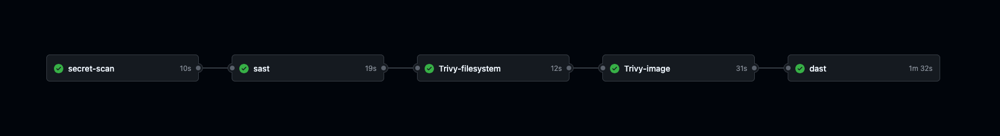
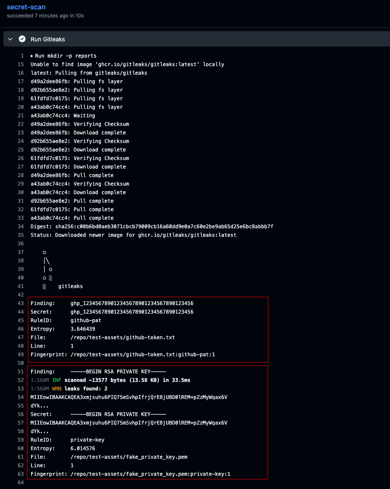
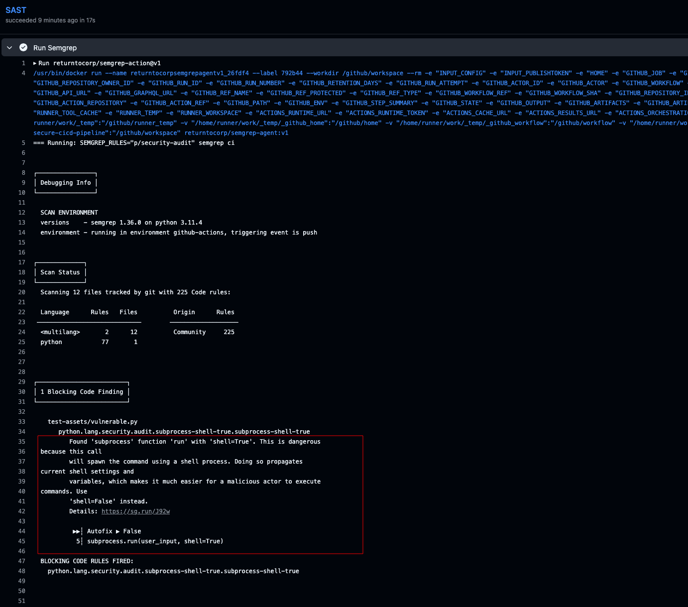
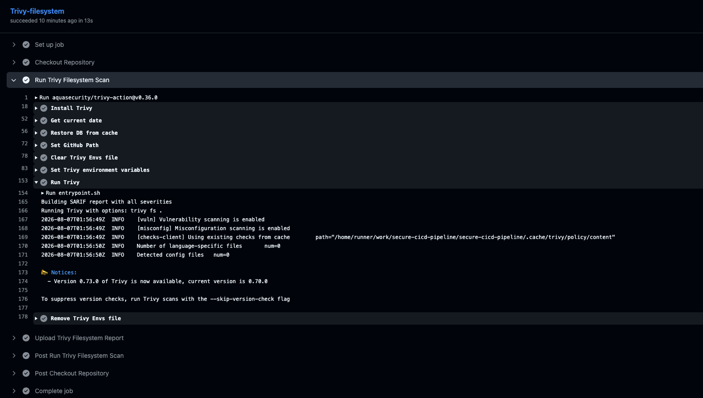
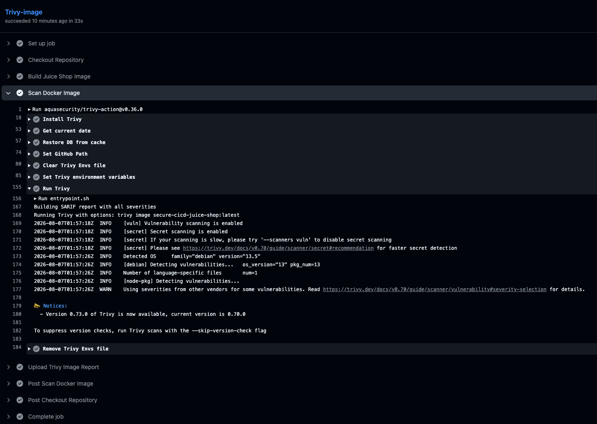
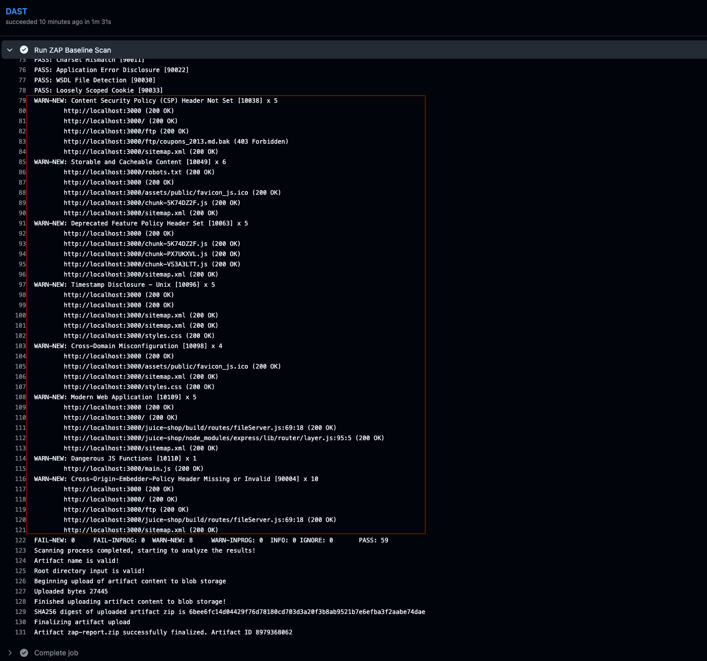

# Secure CI/CD Pipeline for Continuous Application Security

A production-inspired DevSecOps pipeline that integrates automated security testing into the software development lifecycle using GitHub Actions.

The pipeline automatically performs secret detection, static application security testing (SAST), dependency and container vulnerability scanning, and dynamic application security testing (DAST) before software can progress through the delivery pipeline.

OWASP Juice Shop is used as the target application because it is intentionally vulnerable and widely adopted for application security training. Additionally, the repository contains intentionally vulnerable test assets used to verify that the integrated security controls function as expected.

---

## Features

- Automated GitHub Actions workflow
- Secret scanning with Gitleaks
- Static Application Security Testing (SAST) using Semgrep
- Filesystem vulnerability scanning with Trivy
- Container image vulnerability scanning with Trivy
- Dynamic Application Security Testing (DAST) using OWASP ZAP
- Downloadable security reports
- Docker-based testing environment

---

# Security Pipeline

```text
Developer Push
        │
        ▼
GitHub Actions
        │
        ▼
Secret Scanning (Gitleaks)
        │
        ▼
Static Code Analysis (Semgrep)
        │
        ▼
Filesystem Scan (Trivy)
        │
        ▼
Container Image Scan (Trivy)
        │
        ▼
Dynamic Application Security Testing (OWASP ZAP)
        │
        ▼
Security Reports
```

---

## Security Controls

### Secret Scanning

The pipeline uses **Gitleaks** to detect exposed credentials and sensitive information before they become part of the repository history.

Examples include:

- Private keys
- API keys
- Access tokens
- Passwords
- SSH keys

---

### Static Application Security Testing (SAST)

The pipeline uses **Semgrep** to analyse source code without executing the application.

The repository includes intentionally vulnerable code within the `test-assets` directory to demonstrate the effectiveness of the SAST stage.

Example findings include:

- Command Injection
- Unsafe subprocess execution
- Insecure coding patterns

---

### Filesystem Vulnerability Scanning

The repository is analysed using **Trivy** before containerisation.

The scan identifies:

- Vulnerable dependencies
- Security misconfigurations
- Filesystem vulnerabilities

---

### Container Image Scanning

Trivy scans the Docker image to identify operating system and package vulnerabilities before deployment.

Example findings include:

- Vulnerable packages
- Embedded secrets
- Base image vulnerabilities

---

### Dynamic Application Security Testing (DAST)

The pipeline deploys OWASP Juice Shop and performs a passive security assessment using **OWASP ZAP Baseline Scan**.

Example findings include:

- Missing Content Security Policy
- Missing Cross-Origin-Embedder-Policy
- Missing security headers
- Timestamp disclosure
- Dangerous JavaScript functions

---

# Repository Structure

```text
.
├── .github/
│   └── workflows/
│       └── security.yml
├── docs/
│   └── images/
├── reports/
├── scripts/
├── test-assets/
│   ├── vulnerable.py
│   ├── fake_private_key.pem
│   └── README.md
├── docker-compose.yml
├── README.md
└── LICENSE
```

---

# Workflow Results

## Complete Pipeline



---

## Secret Scanning (Gitleaks)



---

## Static Analysis (Semgrep)



---

## Filesystem Scan (Trivy)



---

## Container Image Scan (Trivy)



---

## Dynamic Analysis (OWASP ZAP)



---

# Technology Stack

- GitHub Actions
- Docker
- Gitleaks
- Semgrep
- Trivy
- OWASP ZAP
- YAML

---

# Running the Project

Clone the repository.

```bash
git clone https://github.com/<your-username>/secure-cicd-pipeline.git
cd secure-cicd-pipeline
```

Start OWASP Juice Shop.

```bash
docker compose up -d
```

The application will be available at:

```
http://localhost:3000
```

Every push to the repository automatically executes the security pipeline.

---

# Test Assets

The `test-assets` directory contains intentionally vulnerable files used exclusively to validate the integrated security tools.

These files demonstrate that:

- Gitleaks correctly detects exposed private keys.
- Semgrep identifies insecure coding patterns.

The assets are included solely for educational and testing purposes and must never be reused in production systems.

---

# Learning Outcomes

This project demonstrates practical experience with:

- DevSecOps
- GitHub Actions
- CI/CD security
- Secret scanning
- Static Application Security Testing
- Container security
- Vulnerability management
- Dynamic Application Security Testing
- Docker
- Security automation

---

# Future Improvements

Potential enhancements include:

- CodeQL integration
- Software Bill of Materials (SBOM) generation
- Container image signing with Cosign
- Kubernetes security scanning
- Infrastructure as Code scanning
- Slack or Microsoft Teams notifications
- Security dashboards
- Automated deployment following successful security validation

---

# Disclaimer

OWASP Juice Shop is intentionally vulnerable and is used solely for security education and testing.

Similarly, the files contained within the `test-assets` directory are intentionally insecure and exist only to demonstrate the effectiveness of the integrated security controls. They must not be used in production environments.

---

# License

This project is licensed under the MIT License.